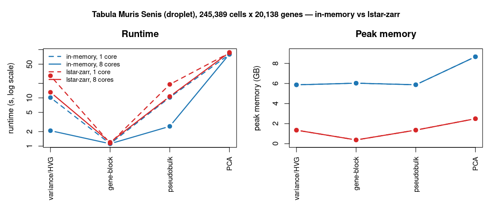

# pagoda2.1 disk-backing benchmarks

How the in-memory and **lstar-zarr** backends compare on the standard pagoda2
operations, and which kit produces the numbers. Two studies live here:

- **Correctness** (`RESULTS.md`) — lstar-zarr is bit-identical to the in-memory
  golden on every op (Tabula Muris Marrow, 40k cells).
- **Scaling: speed + memory** (this file) — the same backends at large scale.
- **kNN backend** (`KNN_BACKEND.md`) — why pagoda2 moved to threaded RcppHNSW.

## Scaling: in-memory vs lstar-zarr (Tabula Muris Senis droplet, 245,389 cells × 20,138 genes)

`prep_tms.R` builds the shared artifacts (raw matrix via hdf5r, single HVG fit,
`cell_ontology_class` grouping); `build_store_tms.R` writes the **chunked**
(2M-nnz/chunk, gene-major CSC) lstar store; `run_grid.sh` times each op in an
isolated process under `/usr/bin/time -v` (runtime = the op's own wall; memory =
process peak RSS); `plot_bench.R` draws the figure.



Color = backend (blue in-memory, red lstar-zarr); dashed = 1 core, solid = 8.

| op | mem 1c | mem 8c | zarr 1c | zarr 8c | mem RSS | zarr RSS |
|----|----|----|----|----|----|----|
| variance/HVG  | 10.1s | **2.1s** | 28.7s | **13.1s** | 6.0 GB | **1.4 GB** |
| pseudobulk    | 10.2s | **2.6s** | 19.0s | **10.7s** | 6.0 GB | **1.4 GB** |
| gene-block(20)| 1.1s  | 1.1s | 1.2s | 1.2s | 6.2 GB | **0.4 GB** |
| PCA (irlba)   | 79.7s | 80.9s | 85.4s | 87.7s | 8.9 GB | **2.6 GB** |

**Takeaways.**
- **Speed:** in-memory is ~2–3× faster (data already in RAM). Both backends'
  streaming reductions (variance, pseudobulk) **thread ~3–5×**; the chunked store
  is what lets the zarr fused reducers stream + thread (a single-chunk store was
  ~3× slower and barely threaded).
- **Memory:** lstar-zarr is the win — **3–16× less peak RSS** (bounded streaming,
  ~0.4–2.6 GB vs the in-memory matrix's 6–9 GB). This is what makes
  larger-than-RAM and portable processing feasible.
- **PCA is flat 1→8 cores in *both* backends** — see the PCA-engine note below.

## PCA engine side-eval (irlba vs RSpectra vs randomized SVD)

irlba's cost is the sequential Lanczos recurrence over single-threaded sparse
matrix–vector products, so it doesn't parallelize. On the 245k × 2000-odgene
block (k=50, 8 BLAS threads), vs a high-accuracy reference:

| engine | time | sv error | top-20 subspace \|cor\| |
|----|----|----|----|
| irlba (Lanczos) | 66.2s | 3.8e-9 | 1.0000 |
| RSpectra::svds (C++ Spectra) | **61.7s** | 1.9e-11 | 1.0000 |
| rsvd q=2 (randomized) | **47.1s** | 1.3e-2 | 0.9898 |
| rsvd q=7 (randomized) | 124.0s | 1.4e-3 | 1.0000 |

- **RSpectra** (C++ Spectra) is a near-drop-in for irlba: a bit faster and more
  accurate.
- **Randomized SVD (`rsvd`, OSCA's `RandomParam`)** at low power-iteration count
  (`q=2`) is **~30% faster** with ~1% singular-value error / 0.99 subspace —
  fine for clustering/embedding. Its edge comes from doing only a **few passes**
  over the matrix, which is why OSCA reports a *larger* win on disk-backed data
  (each pass = IO); here the block is in-memory, so the win is modest. High `q`
  (more passes) erases the advantage.
- The real PCA speedup would combine randomized few-passes with a **threaded
  C++ SpMM** (RcppEigen / Spectra block solvers / PRIMME) over streamed blocks —
  this is the one op that could go from "flat" to scaling.

## Reproduce
```sh
Rscript benchmark/prep_tms.R                                  # artifacts (DATASET / BENCH_DIR env)
BENCH_STORE=/tmp/tms245k_csc.lstar.zarr Rscript benchmark/build_store_tms.R   # chunked CSC store
BENCH_DIR=/tmp/bench_tms BENCH_STORE=/tmp/tms245k_csc.lstar.zarr BENCH_FIELD=counts \
  BENCH_PCA_ODGENES=2000 bash benchmark/run_grid.sh           # mem/zarr × 1/8-core grid
BENCH_DIR=/tmp/bench_tms Rscript benchmark/plot_bench.R       # the figure
```
