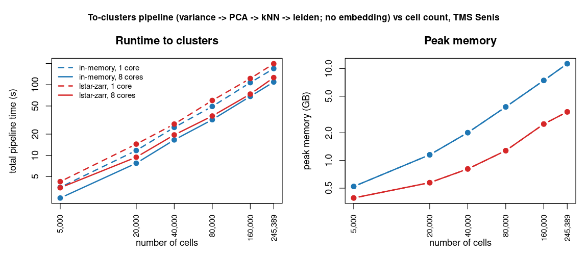

# pagoda2.1 disk-backing benchmarks

How the in-memory and **lstar-zarr** backends compare on the standard pagoda2
operations, and which kit produces the numbers. Two studies live here:

- **Correctness** (`RESULTS.md`) — lstar-zarr is bit-identical to the in-memory
  golden on every op (Tabula Muris Marrow, 40k cells).
- **Scaling: speed + memory** (this file) — the same backends at large scale.
- **kNN backend** (`KNN_BACKEND.md`) — why pagoda2 moved to threaded RcppHNSW.

## Scaling: in-memory vs lstar-zarr (Tabula Muris Senis droplet, 245,389 cells × 20,138 genes)

`prep_tms.R` builds the shared artifacts (raw matrix via hdf5r, single HVG fit,
`cell_ontology_class` grouping); `build_store_tms.R` writes the **chunked**
(2M-nnz/chunk, gene-major CSC) lstar store; `run_grid.sh` times each op in an
isolated process under `/usr/bin/time -v` (runtime = the op's own wall; memory =
process peak RSS); `plot_bench.R` draws the figure.

### Total to-clusters pipeline vs cell count (the headline)

Total time and peak memory for the full **to-clusters pipeline** (variance/HVG →
PCA → kNN → leiden; **no embedding, no plots**) as a function of cell count,
subsampling the 245k data to 5k–245k. `prep_scale.R` builds the per-size
artifacts + chunked stores; `run_scale.sh` runs each pipeline isolated under
`/usr/bin/time -v`; `plot_scale.R` draws it (color = backend, dashed = 1 core,
solid = 8; log–log).



| cells | mem 8c time | zarr 8c time | mem peak | zarr peak |
|----|----|----|----|----|
| 5,000 | 2.5s | 3.5s | 0.5 GB | 0.4 GB |
| 20,000 | 7.7s | 9.4s | 1.2 GB | 0.6 GB |
| 40,000 | 16.6s | 19.5s | 2.0 GB | 0.8 GB |
| 80,000 | 32.0s | 36.1s | 3.9 GB | 1.3 GB |
| 160,000 | 68.3s | 73.7s | 7.6 GB | 2.6 GB |
| 245,389 | 109.2s | 126.1s | 11.5 GB | 3.5 GB |

- **Time** scales ~linearly with cells; in-memory is ~15–20% faster than
  lstar-zarr; 8 cores ≈ 1.6× over 1 core (the threadable variance/kNN steps — PCA
  stays flat).
- **Memory** is where the backends diverge: in-memory grows ~linearly to **11.5 GB**
  at 245k, while lstar-zarr's bounded streaming grows gently to **3.5 GB** — the gap
  *widens* with scale (3.3× at 245k, larger downstream). This is what makes
  larger-than-RAM and portable processing feasible. (1-core and 8-core memory
  overlap — peak RSS is core-independent.)

### Per-operation breakdown (single ops at 245k)

Where the pipeline's time/memory goes, op by op (`run_grid.sh` / `plot_bench.R`):


| op | mem 1c | mem 8c | zarr 1c | zarr 8c | mem RSS | zarr RSS |
|----|----|----|----|----|----|----|
| variance/HVG  | 10.1s | **2.1s** | 28.7s | **13.1s** | 6.0 GB | **1.4 GB** |
| pseudobulk    | 10.2s | **2.6s** | 19.0s | **10.7s** | 6.0 GB | **1.4 GB** |
| gene-block(20)| 1.1s  | 1.1s | 1.2s | 1.2s | 6.2 GB | **0.4 GB** |
| PCA †         | 79.7s | 80.9s | 85.4s | 87.7s | 8.9 GB | **2.6 GB** |

- **Streaming reductions** (variance, pseudobulk) **thread ~3–5×** in both backends;
  the chunked store is what lets the zarr fused reducers stream + thread (a
  single-chunk store was ~3× slower and barely threaded).
- **Memory:** lstar-zarr uses **3–16× less peak RSS** per op (bounded streaming).
- † PCA was flat 1→8 cores here on **irlba**; this grid predates the engine switch.
  pagoda2 now defaults to **RSpectra** (~35% faster, ~53s; still doesn't thread —
  sparse matvec is serial). See the PCA-engine eval below.

## PCA engine side-eval (irlba vs RSpectra vs randomized SVD)

irlba's cost is the sequential Lanczos recurrence over single-threaded sparse
matrix–vector products, so it doesn't parallelize. On the 245k × 2000-odgene
block (k=50, 8 BLAS threads), vs a high-accuracy reference (uncentered):

| engine | time | sv error | top-20 subspace \|cor\| |
|----|----|----|----|
| irlba (Lanczos) | 66.2s | 3.8e-9 | 1.0000 |
| RSpectra::svds (C++ Spectra) | **61.7s** | 1.9e-11 | 1.0000 |
| rsvd q=2 (randomized) | **47.1s** | 1.3e-2 | 0.9898 |
| rsvd q=7 (randomized) | 124.0s | 1.4e-3 | 1.0000 |

**With centering (what PCA actually uses)** the gap is *larger*: the centered
RSpectra operator (implicit centering via a matrix operator, no densification)
ran **52.9s vs irlba's 81.5s — ~35% faster — at identical accuracy** (|cor|=1.0).
**pagoda2 now defaults to RSpectra** for PCA/LSI/joint reductions (irlba fallback;
`.pagoda2_truncated_svd`). It still doesn't *thread* (sparse matvec is serial),
but it's a free ~35% win on the single largest pipeline step.

- **RSpectra** (C++ Spectra): faster than irlba (more so centered) and more
  accurate — now the default engine.
- **Randomized SVD (`rsvd`, OSCA's `RandomParam`)** at low power-iteration count
  (`q=2`) is **~30% faster** with ~1% singular-value error / 0.99 subspace —
  fine for clustering/embedding. Its edge comes from doing only a **few passes**
  over the matrix, which is why OSCA reports a *larger* win on disk-backed data
  (each pass = IO); here the block is in-memory, so the win is modest. High `q`
  (more passes) erases the advantage.
- The real PCA speedup would combine randomized few-passes with a **threaded
  C++ SpMM** (RcppEigen / Spectra block solvers / PRIMME) over streamed blocks —
  this is the one op that could go from "flat" to scaling.

## Reproduce
```sh
Rscript benchmark/prep_tms.R                                  # artifacts (DATASET / BENCH_DIR env)
BENCH_STORE=/tmp/tms245k_csc.lstar.zarr Rscript benchmark/build_store_tms.R   # chunked CSC store
BENCH_DIR=/tmp/bench_tms BENCH_STORE=/tmp/tms245k_csc.lstar.zarr BENCH_FIELD=counts \
  BENCH_PCA_ODGENES=2000 bash benchmark/run_grid.sh           # mem/zarr × 1/8-core grid
BENCH_DIR=/tmp/bench_tms Rscript benchmark/plot_bench.R       # the figure
```
