# Introduction

This walkthrough will guide you over the analysis of a single-cell RNA-seq sample with pagoda. We will start with loading and quality controlling the dataset. Then we will process the dataset with pagoda2 and finally generate an interactive web application for interactive exploration of the dataset.

# Analysis

## Preliminary: Loading the libraries

```r
library(Matrix)
library(pagoda2)
```

```
## Loading required package: igraph
```

```
## 
## Attaching package: 'igraph'
```

```
## The following objects are masked from 'package:stats':
## 
##     decompose, spectrum
```

```
## The following object is masked from 'package:base':
## 
##     union
```

```r
library(igraph)
```

## Part 1: Loading the QC'ing the dataset

For the purposes of this exercise we have pre-generated a dataset of 3000 bone marrow cells that you can load as a matrix directly. The following command load the data as a sparse matrix and checks it's size:

```r
cm <- readRDS(file.path(find.package('pagoda2'), 'extdata', 'sample_BM1.rds'))
dim(cm)
```

```
## [1] 33694  3000
```

We see that the matrix has 33k rows and 3k columns. Next let's have a look at our matrix to see what is in it. We see that genes are named using common gene names and columns by cell barcode.

```r
cm[1:3, 1:3]
```

```
## 3 x 3 sparse Matrix of class "dgCMatrix"
##              MantonBM1_HiSeq_1-TCTATTGGTCTCTCGT-1
## RP11-34P13.3                                    .
## FAM138A                                         .
## OR4F5                                           .
##              MantonBM1_HiSeq_1-GAATAAGTCACGCATA-1
## RP11-34P13.3                                    .
## FAM138A                                         .
## OR4F5                                           .
##              MantonBM1_HiSeq_1-ACACCGGTCTAACTTC-1
## RP11-34P13.3                                    .
## FAM138A                                         .
## OR4F5                                           .
```
We can get more information about how the matrix is stored by running str(). To find out more information about the sparse matrix format check the documentation of the 'Matrix' R package.

```r
str(cm)
```

```
## Formal class 'dgCMatrix' [package "Matrix"] with 6 slots
##   ..@ i       : int [1:2613488] 33 45 72 153 353 406 436 440 457 484 ...
##   ..@ p       : int [1:3001] 0 864 1701 2607 3256 3856 4537 5271 6030 7002 ...
##   ..@ Dim     : int [1:2] 33694 3000
##   ..@ Dimnames:List of 2
##   .. ..$ : chr [1:33694(1d)] "RP11-34P13.3" "FAM138A" "OR4F5" "RP11-34P13.7" ...
##   .. ..$ : chr [1:3000(1d)] "MantonBM1_HiSeq_1-TCTATTGGTCTCTCGT-1" "MantonBM1_HiSeq_1-GAATAAGTCACGCATA-1" "MantonBM1_HiSeq_1-ACACCGGTCTAACTTC-1" "MantonBM1_HiSeq_1-TCATTTGGTACGCTGC-1" ...
##   ..@ x       : num [1:2613488] 1 1 1 9 1 3 1 2 2 20 ...
##   ..@ factors : list()
```

Next let's look at the distribution of molecules per cell and molecules per gene for this dataset in log10 scale:

```r
par(mfrow=c(1,2), mar = c(3.5,3.5,2.0,0.5), mgp = c(2,0.65,0), cex = 1.0)
hist(log10(colSums(cm)+1), main='molecules per cell', col='cornsilk', xlab='log10(molecules per cell)')
hist(log10(rowSums(cm)+1), main='molecules per gene', col='cornsilk', xlab='log10(molecules per gene])')
```

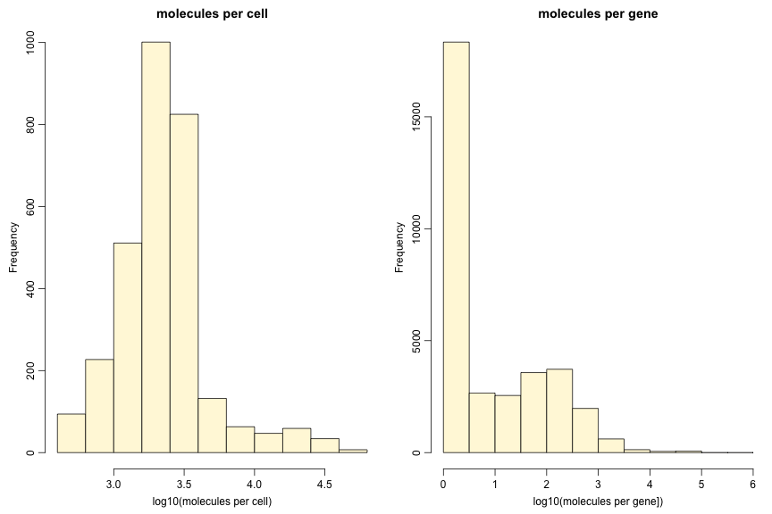

This dataset has already been filtered for low quality cells, so we don't see any cells with fewer that 10^3 UMIs. We can still use the pagoda2 default QC function to filter any cells that don't fit the expected detected gene vs molecule count relationship. In this case we filter out only 2 cells.

```r
counts <- gene.vs.molecule.cell.filter(cm, min.cell.size=500)
```

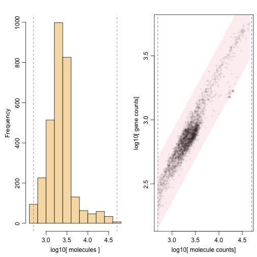

Next thing we want to do is to find lowly expressed genes and remove them from the dataset. Subsequent pagoda processing will do this automatically for extremely lowly expressed genes anyway.


```r
hist(log10(rowSums(counts)+1), main='Molecules per gene', xlab='molecules (log10)', col='cornsilk')
abline(v=1, lty=2, col=2)
```

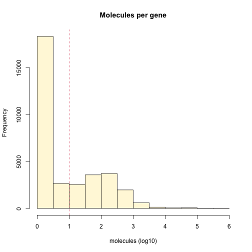
 Let's filter and check the size of the resulting matrix:

```r
counts <- counts[rowSums(counts)>=10, ]
dim(counts)
```

```
## [1] 12693  2998
```


## Part 2: Analysing data with Pagoda2
We see that we now have 12k genes and 2998 cells. We are now ready to analyse our data with Pagoda2. Keep in mind that all of the following steps can be done with just two functions automatically but for the purposes of this coarse we will go over them step by step to understand what we are doing in more detail. Doing these steps manually also allows us to tune parameters.

First we will generate a pagoda object that will contain all our results. Our input matrix contains duplicated gene names (usually originating from different transcripts in the counting process). The easier way to resolve this problem is by making the gene names unique:


```r
rownames(counts) <- make.unique(rownames(counts))
r <- Pagoda2$new(counts,log.scale=TRUE, n.cores=2)
```

```
## 2998cells,12693genes; normalizing ...
```

```
## using plain model
```

```
## log scale ...
```

```
## done.
```

Check that you have the matrix in the correct orientation and that number of cells you are getting here is what you expect (like we do here). The input matrix must be in the genes x cells configuration.

Also note the n.cores parameter. Change this value to match the number of CPU cores on your system.

Next, we’ll adjust the variance, to normalize the extent to which genes with (very) different expression magnitudes will contribute to the downstream anlaysis:

```r
r$adjustVariance(plot=TRUE, gam.k=10)
```

```
## calculating variance fit ...
```

```
##  using gam
```

```
## 187overdispersed genes ...187
```

```
## persisting ...
```

```
## done.
```

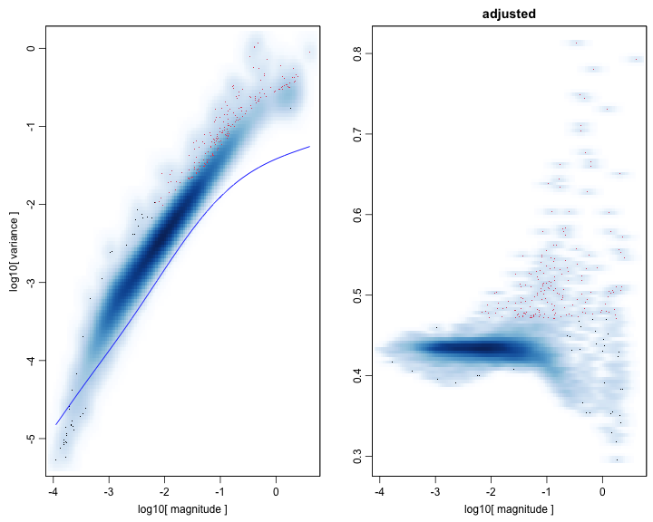

There are many alternative ways of proceeding with the downstream analysis. Below we’ll use the simplest, default scenario, where we first reduce the dataset dimensions by running PCA, and then move into k-nearest neighbor graph space for clustering and visualization calculations. First, the PCA reduction. Depending on the complexity of the dataset you are analysing you may want to adjust he nPcs parameter.


```r
r$calculatePcaReduction(nPcs=50, n.odgenes=3e3)
```

```
## running PCA using 3000 OD genes .
```

```
## .
## .
## .
```

```
##  done
```

Next we will generate a KNN graph of cells that will allow us to identify clusters of cells.

```r
r$makeKnnGraph(k=40, type='PCA', center=TRUE, distance='cosine')
```

```
## creating space of type angular done
## adding data ... done
## building index ... done
## querying ... done
```

Next on the basis of this KNN we will call clusters

```r
r$getKnnClusters(method=infomap.community, type='PCA')
```

Next we generate a 2 dimensional embedding of the data for visualization purposes with largeVis. LargeVis is much faster that the tSNE often used in single-cell analysis.

```r
M <- 30
r$getEmbedding(type='PCA', embeddingType = 'largeVis', M=M, perplexity=30, gamma=1/M, alpha=1)
```

```
## Estimating embeddings.
```

and we plot the data:


```r
r$plotEmbedding(type='PCA', show.legend=FALSE, mark.clusters=TRUE, min.group.size=50, shuffle.colors=FALSE, mark.cluster.cex=1, alpha=0.1, main='clusters (largeVis)')
```

```
## Warning: Ignoring unknown parameters: mark.clusters, min.group.size,
## mark.cluster.cex, main
```

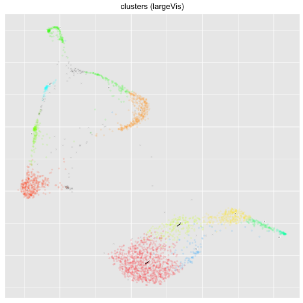

Next we can generate and plot a tSNE embedding. This can take a while to run!

```r
r$getEmbedding(type='PCA', embeddingType='tSNE', perplexity=50,verbose=FALSE)
```

```
## calculating distance ...
```

```
## pearson ...
```

```
## running tSNE using2cores:
```

```r
r$plotEmbedding(type='PCA', embeddingType='tSNE', show.legend=FALSE, mark.clusters=TRUE, min.group.size=1, shuffle.colors=FALSE, mark.cluster.cex=1, alpha=0.1, main='clusters (tSNE)')
```

```
## Warning: Ignoring unknown parameters: mark.clusters, min.group.size,
## mark.cluster.cex, main
```

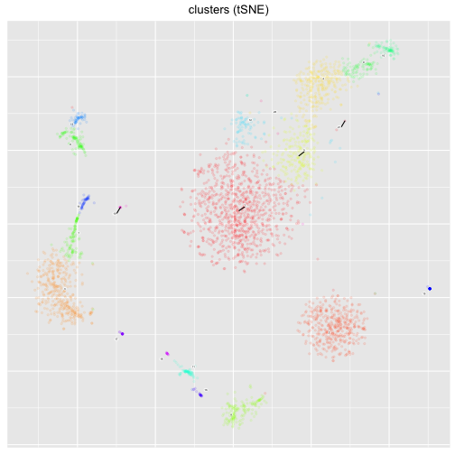

We can overlay the expresssion of specific marker genes on this embedding to identify clusters. For example HBB will identify heme cells.


```r
gene <-"HBB"
r$plotEmbedding(type='PCA', embeddingType='tSNE', colors=r$counts[,gene], shuffle.colors=FALSE, mark.cluster.cex=1, alpha=0.1, main=gene)
```

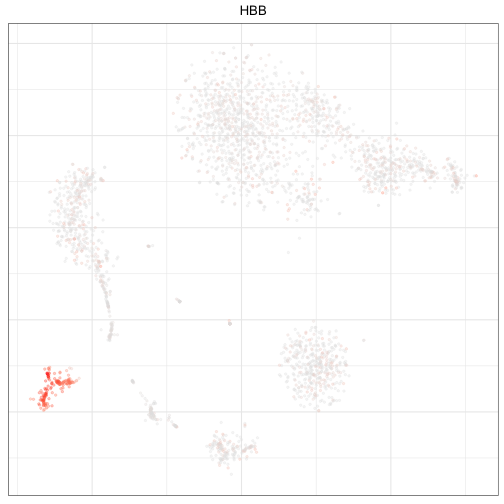


```r
gene <-"LYZ"
r$plotEmbedding(type='PCA', embeddingType='tSNE', colors=r$counts[,gene], shuffle.colors=FALSE, mark.cluster.cex=1, alpha=0.1, main=gene)
```

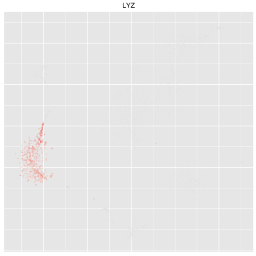

Pagoda2 allows us to generate multiple alternative clusterings. Here will will use multilevel and walktrap

```r
r$getKnnClusters(method=multilevel.community, type='PCA', name='multilevel')
r$getKnnClusters(method=walktrap.community, type='PCA', name='walktrap')
```

Internally the clusters are saved in the clusters variable under the reduction from which they were obtained:


```r
str(r$clusters)
```

```
## List of 1
##  $ PCA:List of 3
##   ..$ community : Factor w/ 21 levels "1","2","3","4",..: 5 1 1 6 6 1 2 4 2 7 ...
##   .. ..- attr(*, "names")= chr [1:2998] "MantonBM1_HiSeq_1-TCTATTGGTCTCTCGT-1" "MantonBM1_HiSeq_1-GAATAAGTCACGCATA-1" "MantonBM1_HiSeq_1-ACACCGGTCTAACTTC-1" "MantonBM1_HiSeq_1-TCATTTGGTACGCTGC-1" ...
##   ..$ multilevel: Factor w/ 11 levels "1","2","3","4",..: 4 10 10 7 7 10 5 3 5 8 ...
##   .. ..- attr(*, "names")= chr [1:2998] "MantonBM1_HiSeq_1-TCTATTGGTCTCTCGT-1" "MantonBM1_HiSeq_1-GAATAAGTCACGCATA-1" "MantonBM1_HiSeq_1-ACACCGGTCTAACTTC-1" "MantonBM1_HiSeq_1-TCATTTGGTACGCTGC-1" ...
##   ..$ walktrap  : Factor w/ 11 levels "1","2","3","4",..: 3 8 8 2 2 8 9 6 9 5 ...
##   .. ..- attr(*, "names")= chr [1:2998] "MantonBM1_HiSeq_1-TCTATTGGTCTCTCGT-1" "MantonBM1_HiSeq_1-GAATAAGTCACGCATA-1" "MantonBM1_HiSeq_1-ACACCGGTCTAACTTC-1" "MantonBM1_HiSeq_1-TCATTTGGTACGCTGC-1" ...
```

We can now compare these against infomap:


```r
par(mfrow=c(1,2))
r$plotEmbedding(type='PCA', embeddingType='tSNE', groups=r$clusters$PCA$community, show.legend=FALSE, mark.clusters=TRUE, min.group.size=1, shuffle.colors=FALSE, mark.cluster.cex=1, alpha=0.1, main='infomap clusters (tSNE)')
```

```
## Warning: Ignoring unknown parameters: mark.clusters, min.group.size,
## mark.cluster.cex, main
```

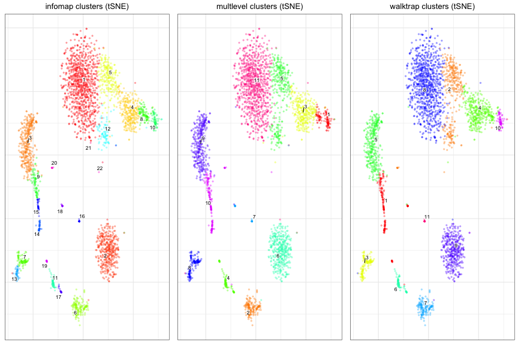

```r
r$plotEmbedding(type='PCA',embeddingType='tSNE', clusterType='multilevel', show.legend=FALSE, mark.clusters=TRUE, min.group.size=1, shuffle.colors=FALSE, mark.cluster.cex=1, alpha=0.1, main='multlevel clusters (tSNE)')
```

```
## Warning: Ignoring unknown parameters: mark.clusters, min.group.size,
## mark.cluster.cex, main
```

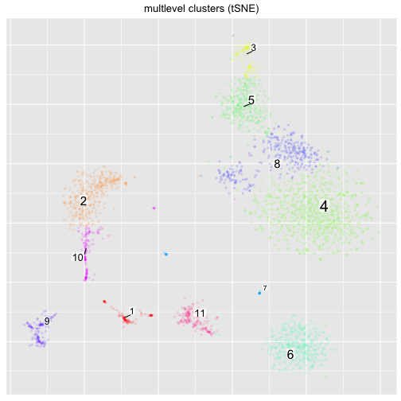

We can then perform differential expression between these clusters


```r
r$getDifferentialGenes(type='PCA', verbose=TRUE, clusterType='community')
```

```
## running differential expression with 21 clusters ...
```

```
## adjusting p-values ...
```

```
## done.
```


and visualise the top markers of a specific cluster

```r
de <- r$diffgenes$PCA[[1]][['2']]
r$plotGeneHeatmap(genes=rownames(de)[1:15], groups=r$clusters$PCA[[1]])
```

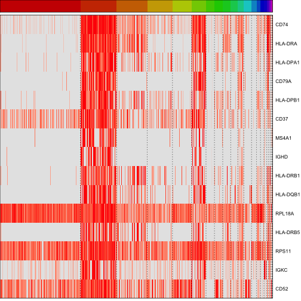


```r
gene <-"CD74"
r$plotEmbedding(type='PCA', embeddingType='tSNE', colors=r$counts[,gene], shuffle.colors=FALSE, mark.cluster.cex=1, alpha=0.1, main=gene)
```

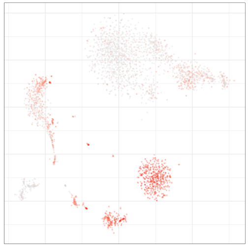

At this point we can perform pathway overdispersion analysis (in the same wy we would with pagoda1) or look for hierarchical differential expression. The following two chunks will run overdispersion analysis (don't run the second one, it take too long!). Overdispersion analysis usually takes too long with the latest datasets composed of 1000's of cells, for this reason we prefer hierarchical differential expression. 

We will need the output of the first of the following two blocks for our web app generation:

```r
suppressMessages(library(org.Hs.eg.db))
# translate gene names to ids
ids <- unlist(lapply(mget(colnames(r$counts), org.Hs.egALIAS2EG, ifnotfound=NA), function(x) x[1]))
# reverse map
rids <- names(ids)
names(rids) <- ids
# list all the ids per GO category
go.env <- list2env(eapply(org.Hs.egGO2ALLEGS,function(x) as.character(na.omit(rids[x]))))
```


```r
## DON'T RUN
## test over dispersion
# r$testPathwayOverdispersion(go.env, verbose=TRUE, correlation.distance.threshold=0.95, recalculate.pca=FALSE, top.aspects=15)
```


Run hierarchical differential expression. This examines cells down a hierarchy of clusters and determines differentially expressed genes at every split.

```r
hdea <- r$getHierarchicalDiffExpressionAspects(type='PCA', clusterName='community', z.threshold=3)
```

```
## usingcommunity clustering forPCAspace
```


Next we will generate a web app that will allow us to browse the dataset interactively. Note that all these steps can be performed with the basicP2web() function.

We will need to prepare a set of genes that we want to be accessible from the app. For the hierarchical differential expression to work we must include the geneset from the hierarchical differential expression. However we can include any genesets we want, including GO geneset and custom sets of marker genes.

```r
genesets <- hierDiffToGenesets(hdea)
str(genesets[1:2])
```

```
## List of 2
##  $ 15.vs.16  :List of 2
##   ..$ properties:List of 3
##   .. ..$ locked          : logi TRUE
##   .. ..$ genesetname     : chr "15.vs.16"
##   .. ..$ shortdescription: chr "15.vs.16"
##   ..$ genes     : chr [1:157] "TSC22D3" "SSR4" "CD79A" "KLF2" ...
##  $ 15.16.vs.2:List of 2
##   ..$ properties:List of 3
##   .. ..$ locked          : logi TRUE
##   .. ..$ genesetname     : chr "15.16.vs.2"
##   .. ..$ shortdescription: chr "15.16.vs.2"
##   ..$ genes     : chr [1:311] "MZB1" "JCHAIN" "HSP90B1" "ITM2C" ...
```

To add GO Terms as genesets run the following

```r
library(GO.db)
```

```
## 
```

```r
termDescriptions <- Term(GOTERM[names(go.env)]) # saves a good minute or so compared to individual lookups
sn <- function(x) { names(x) <- x; x}
genesets.go <- lapply(sn(names(go.env)),function(x) {
  list(properties=list(locked=TRUE, genesetname=x, shortdescription=as.character(termDescriptions[x])), genes=c(go.env[[x]]))
})
## concatenate
genesets <- c(genesets, genesets.go)
```

Add per cluster differentially expressed genes to the gene sets

```r
deSets <- get.de.geneset(r, groups = r$clusters$PCA[['community']], prefix = 'de_')
## concatenate
genesets <- c(genesets, deSets)
```

## Part 3: Generate web app
Next we can add metadata to our web app. The metadata we add can be completely arbitrary and include processing parameters, notes of anything else we like. They are provided in a list of strings. If we include an entry called apptitle, this will appear as an app title in our web browser when we open the app.

```r
appmetadata <- list(apptitle = 'October_Demo_App')
```

We also want to update the original pagoda2 object to contain a KNN graph of genes. We will need this to enable the 'find similar gene' feature of our webapp. This takes a moment to complete.

```r
r$makeGeneKnnGraph(n.cores = 2)
```

```
## creating space of type angular done
## adding data ... done
## building index ... done
## querying ... done
```

Finally before we make our web app we want to generate metadata for the cells. The exact data that we will want to incorporate will depend on the dataset we are processing. For example if we are co-processing multiple samples we will usually want to label cells by the sample of origin. We might also want to add our clusterings as metadata. 

Several functions give very detailed control over how metadata will be presented and generated. For example we can generate different palettes or set colors manually. The factorListToMetadata() function will do everything for us, check it's documentation for more details. Here we will generate metadata for the different clusterings we previously generated manually


```r
# Make a list for our metadata
additionalMetadata <- list()
## for Infomap use hue values from 0.1 to 0.5
additionalMetadata$community <- p2.metadata.from.factor(r$clusters$PCA[['community']], displayname = 'Infomap', s = 0.7, v = 0.8,start = 0.1, end = 0.5)
# use different colors for multilevel
additionalMetadata$multilevel <- p2.metadata.from.factor(r$clusters$PCA[['multilevel']], displayname = 'Multilevel', s = 0.9, v = 0.8,start = 0.5, end = 1)
## Manual palette generation for walktrap
a <- r$clusters$PCA[['walktrap']]
library(colorRamps)
p1 <- colorRamps::primary.colors(n = nlevels(a))
names(p1) <- levels(a)
additionalMetadata$walktrap <- p2.metadata.from.factor(r$clusters$PCA[['walktrap']], displayname = 'Walktrap', pal = p1)
```

We are now ready to build our app.

```r
p2web <-
  make.p2.app(
    r,
    dendrogramCellGroups = r$clusters$PCA$community,
    additionalMetadata = additionalMetadata,
    geneSets = genesets,
    appmetadata = appmetadata,
    show.clusters = FALSE # Hide the clusters that were used for the dendrogram from the metadata
  );
```

We can view this app directly from our R session


```r
show.app(app=p2web, name='app')
```

```
## starting httpd help server ... done
```

```
## 
## Server started on host 127.0.0.1 and port 21898 . App urls are:
## 
## 	http://127.0.0.1:21898/custom/RookTest
## [1] "app loaded at: http://127.0.0.1:21898/custom/app/index.html"
```

This app will now be viewable as long as our R session is running. However we also have the option to serialize this app into a binary file on our hard drive that will allow us to view it after we close the R session directly from our browser. This takes about a minute to generate.


```r
p2web$serializeToStaticFast('october2018_pbmc.bin', verbose=TRUE)
```

```
## Writing... matsparse
## 		p array size: 12694 [First entry value: 0]
## 		i array size: 2592780 [First entry value: 12]
## 		x array size: 2592780 [First entry value: 0.231712]
## 	Sparse matrix header information
## 		dim1=2998
## 		dim2=12693
## 		pStartOffset=32
## 		iStartOffset=50808
## 		xStartOffset=10421928
## 		dimnames1StartOffset=20793048
## 		dimnames2StartOffset=20909972
## 		dimnames2EndOffset=21022422
## Writing... mataspect
## 		p array size: 18 [First entry value: 0]
## 		i array size: 11938 [First entry value: 0]
## 		x array size: 11938 [First entry value: -18.5232]
## 	Sparse matrix header information
## 		dim1=2998
## 		dim2=17
## 		pStartOffset=32
## 		iStartOffset=104
## 		xStartOffset=47856
## 		dimnames1StartOffset=95608
## 		dimnames2StartOffset=212532
## 		dimnames2EndOffset=212868
## Writing... sparseMatrixTransp
## 		p array size: 2999 [First entry value: 0]
## 		i array size: 2592780 [First entry value: 7]
## 		x array size: 2592780 [First entry value: 0.306135]
## 	Sparse matrix header information
## 		dim1=12693
## 		dim2=2998
## 		pStartOffset=32
## 		iStartOffset=12028
## 		xStartOffset=10383148
## 		dimnames1StartOffset=20754268
## 		dimnames2StartOffset=20866718
## 		dimnames2EndOffset=20983642
## Making File from payload...
## 	File format information
## 		Index entry size is 140 bytes
## 		File header size is 48 bytes
## 	Preparing header...
## 	Total index size is: 2100 bytes
## 	Constructing index...
## 		Writing entry 0 of size 108 blocks (or 3538944 bytes)
## 		Writing entry 1 of size 1 blocks (or 32768 bytes)
## 		Writing entry 2 of size 16 blocks (or 524288 bytes)
## 		Writing entry 3 of size 4 blocks (or 131072 bytes)
## 		Writing entry 4 of size 29 blocks (or 950272 bytes)
## 		Writing entry 5 of size 1 blocks (or 32768 bytes)
## 		Writing entry 6 of size 1 blocks (or 32768 bytes)
## 		Writing entry 7 of size 1 blocks (or 32768 bytes)
## 		Writing entry 8 of size 73 blocks (or 2392064 bytes)
## 		Writing entry 9 of size 606 blocks (or 19857408 bytes)
## 		Writing entry 10 of size 6 blocks (or 196608 bytes)
## 		Writing entry 11 of size 6 blocks (or 196608 bytes)
## 		Writing entry 12 of size 642 blocks (or 21037056 bytes)
## 		Writing entry 13 of size 7 blocks (or 229376 bytes)
## 		Writing entry 14 of size 641 blocks (or 21004288 bytes)
## Free up entry payloads
```

```
## NULL
```

You can view the offline app by pointing your browser to http://pklab.med.harvard.edu/nikolas/pagoda2/frontend/current/pagodaLocal/index.html

The file can also be shared by uploading it to a web server and be viewed remotely by navigating to the following URL: http://pklab.med.harvard.edu/nikolas/pagoda2/frontend/current/pagodaURL/index.html?fileURL=[URL TO FILE]

Finally don't forget to save your pagoda2 object (serializing is not a substitute for saving)

```r
saveRDS(r, 'pagoda2object.rds')
```

# Quick Analysis


The following describes how to get quickly from a count matrix to to a viewable pagoda2 app that allows you to view your data.
This currently only works for human (organism='hs') and mouse (organism='mm') datasets.


```r
# Get your count matrix in sparse or full format
# For example you can use the 
# readMM() from the Matrix package or the
# read10xMatrix() function from the github barkasn/nbHelpers package
# This matrix can be sparse matrix object from the Matrix package

# countMatrix <- load_my_count_matrix()
# Rows correspond to genes and Columns to cells
# If you experience problems with duplicate cells you can use
# rownames(countMatrix) <- make.unique(rownames(countMatrix))

p2 <- basicP2proc(countMatrix, n.cores = 4) ## 'multilevel' run here

p2$getKnnClusters(method = igraph::infomap.community, type = 'PCA' ,name = 'infomap')
p2$getKnnClusters(method = igraph::walktrap.community, type = 'PCA', name = 'walktrap')

ext.res <- extendedP2proc(p2, n.cores = 4, organism = 'hs')


p2 <- ext.res$p2
go.env <- ext.res$go.env
rm(ext.res)

# Make cell metadata from the default clusters generated during basicP2proc()
# This is optional, metadata.forweb can also be NULL
metadata.listfactors <- list(
    infomap = p2$clusters$PCA$infomap,
    multilevel = p2$clusters$PCA$multilevel,
    walktrap = p2$clusters$PCA$walktrap
);
metadata.forweb <- factorListToMetadata(metadata.listfactors)

# Make the web object
p2.webobject <- webP2proc(p2, additionalMetadata = metadata.forweb, title = 'Quick pagoda2 application', go.env = go.env)

# Serialize to file
# The serialisedApp.bin file will now contain all the information
# required to view the files via the web browser
p2.webobject$serializeToStaticFast('serialisedApp.bin');

# Alternatively you can view your dataset from the R session
# show.app(p2.webobject, browse = TRUE)
```

You can now navigate to <http://pklab.med.harvard.edu/nikolas/pagoda2/frontend/current/pagodaLocal/> and open the 'serialisedApp.bin' file when prompted to view your data.


# Working with Cell Selections


Pagoda2 allows you to easily work with cell selections generated in R or via the web interface.

You can read a file of cell selections generated with the web interface using the readPagoda2SelectionFile() function. This will
generate a list object that contains all the information about the selections. 

You can make cell selection file from a web selection object generated in R using the writePagoda2SelectionFile() function. You can send
this file over email to unambiguously communicate cell subsets.

In R it is often easier to work with cell selections in the form of factors. To convert a selection to a factor you can use the 
factorFromP2Selection() function. This will returned a named factor of the membership of each cell in selections. However in order
to do this you will need to ensure that every cell belong only to one selection. You can check if any cells are in multiple clusters
and clean up your selection object using the functions: calcMulticlassified(), removeSelectionOverlaps(), plotSelectionOverlaps() and
plotMulticlassified(). 

You can also convert a factor to a pagoda2 selection using the factorToP2selection() function.

Other functions for working with selection in R include: 

* getColorsFromP2Selection()
* cellsPerSelectionGroup()
* validateSelectionsObject() 
* getClusterLabelsFromSelection() 
* generateClassificationAnnotation()
* getCellsInSelections(),
* diffExprOnP2FromWebSelection()
* diffExprOnP2FromWebSelectionOneGroup()
* getIntExtNamesP2Selection()
* plotEmbeddingColorByP2Selection()

